# secure-delivery-pipeline

A working software delivery pipeline that treats its own supply chain as the
thing under test. Images are built, scanned, signed and attested on every push —
and the pipeline then **refuses to deploy anything it cannot verify**. The AWS and
Kubernetes layers run against an emulator inside the GitHub Actions runner, so the
whole thing is reproducible by anyone, with no cloud account and no cost.

[](https://github.com/justinepdevasia/secure-delivery-pipeline/actions/workflows/ci-python.yml)
[](https://github.com/justinepdevasia/secure-delivery-pipeline/actions/workflows/ci-dotnet.yml)
[](https://github.com/justinepdevasia/secure-delivery-pipeline/actions/workflows/security.yml)
[](https://github.com/justinepdevasia/secure-delivery-pipeline/actions/workflows/deploy-eks-emulated.yml)
[](https://scorecard.dev/viewer/?uri=github.com/justinepdevasia/secure-delivery-pipeline)
[](LICENSE)

---

## What is real and what is emulated

This matters more than anything else in the README, so it is not buried at the
bottom.

> The supply chain pipeline is **fully operational**: images are built, scanned,
> signed and attested on every push to `main`, and the signatures are
> independently verifiable by anyone with `gh attestation verify`. The AWS and
> Kubernetes layers run against a local AWS emulator inside the GitHub Actions
> runner — Terraform genuinely applies, images genuinely push to an ECR-backed
> registry, and Helm genuinely deploys to a real Kubernetes API server — but **no
> AWS account is involved**. Production values (IRSA, ALB Controller, multi-AZ
> spread) are schema- and policy-validated rather than applied.

Verify the real half yourself, with no access to this repository beyond a clone:

```bash
gh attestation verify \
  oci://ghcr.io/justinepdevasia/secure-delivery-pipeline/api-python:<commit-sha> \
  --repo justinepdevasia/secure-delivery-pipeline
```

| Layer | Status |
| --- | --- |
| Build, scan, SBOM, provenance, signing, **verification** | **Real.** GHCR + Sigstore + GitHub attestations, independently verifiable |
| Bash and Python automation | **Real.** Linted, unit-tested, and executed by the pipeline itself |
| AWS API surface (IAM, STS, ECR, EKS, Secrets Manager, CloudWatch) | **Emulated in-runner** via [Floci](https://github.com/floci-io/floci) — real `terraform apply`, real `docker push`, real cluster |
| Kubernetes | **Real k3s**, started by the emulator's EKS implementation — real `helm install`, real rollout, real probes |
| Production values (IRSA, ALB Controller, multi-AZ) | **Static validation only** — schema and policy tested, never applied |

---

## The pipeline

```mermaid
flowchart LR
  commit([commit]) --> lint[lint · type check · test]
  lint --> build[buildx build]
  build --> smoke1[start container<br/>assert healthz + non-root]
  smoke1 --> trivy{Trivy<br/>CRITICAL/HIGH}
  trivy -->|findings| blocked([blocked — never pushed])
  trivy -->|clean| push[push to GHCR<br/>tagged by commit SHA]
  push --> sbom[SBOM<br/>CycloneDX + SPDX]
  sbom --> diff[sbom-diff<br/>sticky PR comment]
  sbom --> attest[attest SBOM<br/>attest SLSA provenance]
  attest --> sign[cosign sign<br/>keyless]
  sign --> verify{verify-supply-chain.sh}
  verify -->|fails| stop([deploy refused])
  verify -->|passes| gate{datadog-gate}
  gate -->|alerting| stop
  gate -->|clear| ecr[promote to ECR<br/>by digest]
  ecr --> eks[create EKS cluster<br/>real k3s]
  eks --> helm[helm upgrade --install<br/>--atomic, by digest]
  helm --> rollout[wait-for-rollout.sh]
  rollout --> smoke2[smoke-test.sh<br/>in-cluster, JSON shape]
  smoke2 --> dora[dora-metrics]
  rollout -->|failure| rollback[helm rollback<br/>collect-diagnostics.sh]
  smoke2 -->|failure| rollback
```



The two diamonds are the point of the repository. Plenty of pipelines sign
artifacts; comparatively few refuse to deploy when the signature does not check
out.

---

## Supply chain controls

| Control | Implementation | Threat mitigated |
| --- | --- | --- |
| Actions pinned to full commit SHAs, enforced by our own script | [`scripts/audit-action-pins.sh`](scripts/audit-action-pins.sh), required check in `security.yml` | **Compromised third-party action.** A tag is a mutable pointer; whoever takes over a maintainer's account repoints it at their code |
| Images pinned by digest everywhere — base images, emulator, deploys | Dockerfiles, `charts/api` templates, `promote-image.sh` | **Tampered image.** A digest cannot be repointed after review |
| Vulnerability scan **before** the registry, not after | Trivy in `reusable-build-attest.yml`, `exit-code: 1` | **Vulnerable base image.** A vulnerable image never gets a registry address to be pulled from |
| SLSA provenance + SBOM attestations, pushed to the registry | `actions/attest-build-provenance`, `actions/attest-sbom` | **Malicious commit.** Provenance ties the image to the workflow, commit and runner that produced it |
| Keyless signing, verified before deploy, failing closed | `cosign sign` → [`scripts/verify-supply-chain.sh`](scripts/verify-supply-chain.sh) | **Tampered image.** An unsigned or altered digest cannot reach a cluster |
| SBOM diffed against the last build, posted on the PR | [`sbom_diff.py`](tools/src/pipeline_tools/sbom_diff.py) | **Dependency confusion.** A dependency appearing out of nowhere is visible in review instead of buried in a lockfile |
| Committed lockfiles, dependency review on every PR | `requirements*.txt`, `actions/dependency-review-action` | **Dependency confusion.** Resolution cannot drift between build and review |
| Secret scanning over full history, push protection on | Gitleaks in `security.yml`, GitHub push protection | **Leaked credential.** A secret deleted in a later commit is still leaked |
| Explicit least-privilege `permissions:` on every job, enforced by our own tool | [`workflow_audit.py`](tools/src/pipeline_tools/workflow_audit.py) | **Compromised workflow.** A job that cannot write cannot be made to |
| No wildcard OIDC subject claims, asserted at plan time and in tests | `infra/aws/iam-github-oidc.tf`, `infra/aws/tests/security.tftest.hcl` | **Fork PR privilege escalation.** `repo:owner/name:*` lets any fork's workflow assume the role |
| Zero repository secrets | The whole design | **Leaked credential.** There is nothing to leak |

Two of those controls — action pinning and workflow auditing — are enforced by
code written in this repository rather than by an off-the-shelf action. They run
against this repository on every pull request, and there are unit tests asserting
that the repository passes its own rules.

---

## Automation reference

### Bash — `scripts/`

Every script supports `--help`, logs to stderr, writes machine-readable output to
stdout with `--json`, and shares one set of exit codes:
**0** success · **1** generic failure · **2** usage error · **3** timeout ·
**4** verification failure.

| Script | Purpose | Key flags |
| --- | --- | --- |
| [`lib/common.sh`](scripts/lib/common.sh) | Logging, `require_cmd`, `retry_with_backoff`, `die`, JSON escaping | sourced, not executed |
| [`preflight.sh`](scripts/preflight.sh) | Assert required CLIs exist and meet minimum versions, before a job gets twenty minutes in | `--tool NAME[:MIN]`, `--json` |
| [`wait-for-endpoint.sh`](scripts/wait-for-endpoint.sh) | Poll an HTTP endpoint with exponential backoff; never `sleep 30 && hope` | `--url`, `--timeout`, `--expect-status`, `--json` |
| [`wait-for-rollout.sh`](scripts/wait-for-rollout.sh) | Wrap `kubectl rollout status`; collect diagnostics **before** exiting on timeout | `--deployment`, `--timeout`, `--no-diagnostics`, `--json` |
| [`smoke-test.sh`](scripts/smoke-test.sh) | Curl pod inside the cluster; asserts status codes and JSON **shape** with `jq -e`, not substrings | `--service`, `--namespace`, `--json` |
| [`verify-supply-chain.sh`](scripts/verify-supply-chain.sh) | `cosign verify` + `gh attestation verify` against a digest. Fails closed | `--image`, `--digest`, `--repo`, `--skip-sbom`, `--dry-run`, `--json` |
| [`promote-image.sh`](scripts/promote-image.sh) | Copy an image between registries **by digest**; refuses an unsigned source; reports the digest actually written at the target | `--source`, `--digest`, `--target`, `--dry-run`, `--json` |
| [`resolve-image-digest.sh`](scripts/resolve-image-digest.sh) | Resolve a tag to a digest once, at the start of a deploy, so a moving tag cannot split verify from ship | `--image`, `--tag`, `--fallback-latest`, `--json` |
| [`audit-action-pins.sh`](scripts/audit-action-pins.sh) | Enforce this repository's central rule: every `uses:` pinned to a 40-char SHA. `--drift` also reports pins that fell behind their tag | `--check`, `--drift`, `--root`, `--json` |
| [`render-manifests.sh`](scripts/render-manifests.sh) | Render the chart and validate it: kubeconform, kube-linter, conftest. Reports **all** failures, not the first | `--values`, `--skip CHECK`, `--json` |
| [`assert-emulated-infra.sh`](scripts/assert-emulated-infra.sh) | After `terraform apply`, read the resources back through the AWS CLI — a different code path than the one that claimed success | `--prefix`, `--project`, `--json` |
| [`collect-diagnostics.sh`](scripts/collect-diagnostics.sh) | Bundle events, describes, current **and previous** container logs, Helm history and emulator logs into a tarball | `--namespace`, `--release`, `--no-archive` |

Tested with **bats-core** — 119 unit tests. External commands (`kubectl`, `aws`,
`cosign`, `docker`, `helm`) are stubbed by prepending a fixture directory to
`PATH`, so the suite runs offline in seconds.

### Python — `tools/`

An installable package with `console_scripts` entry points, so workflows call
`sbom-diff`, not `python path/to/file.py`. `mypy --strict`, `ruff`, and 84 tests
at 92% coverage. No third-party HTTP dependency — a repository about dependency
risk should not add one for four API calls.

| Command | Module | Purpose |
| --- | --- | --- |
| `workflow-audit` | [`workflow_audit.py`](tools/src/pipeline_tools/workflow_audit.py) | Checks the linters miss: every job declares `permissions`; `pull_request_target` never checks out untrusted refs; attacker-controlled context never interpolated into `run:` |
| `sbom-diff` | [`sbom_diff.py`](tools/src/pipeline_tools/sbom_diff.py) | Diff two CycloneDX SBOMs — added, removed, upgraded, **downgraded** — and post it as a sticky PR comment |
| `dora-metrics` | [`dora.py`](tools/src/pipeline_tools/dora.py) | Deployment frequency, lead time, change failure rate and time to restore from the Actions API, with the definitions printed alongside the numbers |
| `datadog-gate` | [`datadog_gate.py`](tools/src/pipeline_tools/datadog_gate.py) | Refuse to deploy on top of an alerting service. `DD_DRY_RUN` logs the exact request instead of sending it |
| `pr-comment` | [`pr_comment.py`](tools/src/pipeline_tools/pr_comment.py) | Sticky comments: find by hidden marker, update or create |

---

## Workflows

| File | Trigger | Purpose | Elevated permissions |
| --- | --- | --- | --- |
| [`ci-python.yml`](.github/workflows/ci-python.yml) | PR, push to `main` (paths) | ruff, `mypy --strict`, pytest matrix on 3.11/3.12 with an 85% coverage gate; then calls the build workflow | via the called workflow |
| [`ci-dotnet.yml`](.github/workflows/ci-dotnet.yml) | PR, push to `main` (paths) | `dotnet format --verify-no-changes`, build, xUnit; then the same build workflow | via the called workflow |
| [`ci-scripts.yml`](.github/workflows/ci-scripts.yml) | PR, push (scripts, tools, workflows) | shellcheck, shfmt, bats, ruff, mypy, pytest, plus both self-audits | none |
| [`reusable-build-attest.yml`](.github/workflows/reusable-build-attest.yml) | `workflow_call` | Build → smoke → Trivy gate → push → SBOM → diff → attest → sign → **verify** | `packages: write`, `id-token: write`, `attestations: write` |
| [`security.yml`](.github/workflows/security.yml) | PR, push, weekly cron | CodeQL (python, csharp, actions), dependency review, pip-audit, Gitleaks, actionlint, zizmor, Scorecard, and this repo's own auditors | `security-events: write`, `id-token: write` |
| [`manifests.yml`](.github/workflows/manifests.yml) | PR, push (charts, policy, schemas) | helm lint, `kubeconform -strict` against vendored CRD schemas, kube-linter, conftest, Trivy config — for **both** value files | none |
| [`infra-test.yml`](.github/workflows/infra-test.yml) | PR, push (infra) | fmt, validate, tflint, Checkov, Trivy config, and `terraform test` with mocked providers | `security-events: write` |
| [`infra-apply-emulated.yml`](.github/workflows/infra-apply-emulated.yml) | PR, push (infra, emulator action) | Genuine `terraform apply` against the in-runner emulator, asserted through the AWS CLI, then destroyed | none |
| [`deploy-eks-emulated.yml`](.github/workflows/deploy-eks-emulated.yml) | PR (charts, scripts), push to `main`, manual | The showpiece — see the diagram above | `packages: read`, `id-token: write`, `attestations: read` |

Top-level `permissions: contents: read` on every workflow; anything more is
requested per job and audited by `workflow-audit`.

---

## What the emulated deploy actually proves

A recent run, end to end:

```
[INFO] verified: signature
[INFO] verified: provenance
[INFO] verified: sbom
[INFO] supply chain verified for ghcr.io/.../api-python@sha256:321526...
[INFO] promoted ghcr.io/.../api-python@sha256:321526... to 000000000000.dkr.ecr.us-east-1.../api-python@sha256:e621e4...
[INFO] deployment/api-api rolled out in 1s
[INFO] healthz: ok
[INFO] readyz: ready, secrets_source=secretsmanager
[INFO] orders: 2 item(s), shape valid
[INFO] validation: malformed order rejected with 422
[INFO] smoke test passed against http://api-api.default.svc.cluster.local:80
```

`secrets_source=secretsmanager` is worth pausing on: the running pod fetched its
configuration from Secrets Manager through boto3, inside the cluster, over the
same code path it would use in production.

Note also that the promoted digest **differs** from the source digest. Copying a
manifest between registries does not have to preserve it, so `promote-image.sh`
reports what was actually written and the Helm release pins that. Pinning the
source digest would have produced a reference that cannot be pulled.

---

## Repository layout

```
.github/workflows/    ten workflows; one is reusable, one is the showpiece
.github/actions/      setup-floci — starts the AWS emulator, pinned by digest
services/api-python/  FastAPI service with a genuine Secrets Manager code path
services/api-dotnet/  .NET 10 minimal API — proves multi-runtime handling
scripts/              Bash automation (§ Automation reference)
scripts/tests/        119 bats unit tests
tools/                installable Python CLI package, mypy --strict
charts/api/           Helm chart, emulator values and production values
policy/               conftest rego — our own admission rules
schemas/              vendored CRD schemas, so kubeconform runs -strict
infra/aws/            VPC, EKS, Karpenter, ECR, GitHub OIDC + terraform test
infra/datadog/        monitors, SLOs, dashboard — validated, never applied
docs/                 threat model, architecture
```

---

## Demonstration pull requests

Five pull requests, opened and closed, each introducing a real problem so the
control that catches it can be seen firing. Every one is closed with a comment
quoting the actual failure output.

| PR | What it introduces | What caught it |
| --- | --- | --- |
| [#13](https://github.com/justinepdevasia/secure-delivery-pipeline/pull/13) | An action pinned to `@v7` instead of a commit SHA | [`audit-action-pins.sh`](scripts/audit-action-pins.sh) — **written here** |
| [#16](https://github.com/justinepdevasia/secure-delivery-pipeline/pull/16) | Resource limits removed from the chart values | [`policy/workloads.rego`](policy/workloads.rego) — **written here** — and kube-linter, independently |
| [#17](https://github.com/justinepdevasia/secure-delivery-pipeline/pull/17) | `requests==2.19.1`, a version with published advisories | Dependency Review; the pinned lockfile also refused to resolve |
| [#18](https://github.com/justinepdevasia/secure-delivery-pipeline/pull/18) | Credentials committed in a `local.env` | GitHub push protection rejected the `git push` outright; Gitleaks caught the rest in CI |
| [#19](https://github.com/justinepdevasia/secure-delivery-pipeline/pull/19) | A readiness probe pointing at `/readyzz` | Nothing static — only the deploy. `--atomic` rolled back and the diagnostics bundle named the 404 |

Two of those five are caught by controls written in this repository rather than
installed from somewhere.

\#19 is the one worth reading. Its first run failed at the **supply chain gate**
rather than at the rollback, because the digest fallback trusted recency over
provenance. The gate did its job and refused to deploy — but a control firing is
also evidence that something upstream let a bad input through, so
[#21](https://github.com/justinepdevasia/secure-delivery-pipeline/pull/21) fixed
the fallback to verify candidates before choosing one. The demo then failed the
way it was meant to.

## Further reading

- [`docs/threat-model.md`](docs/threat-model.md) — the controls table above, in prose, with what each control does *not* cover
- [`docs/architecture.md`](docs/architecture.md) — data flow, trust boundaries, and why the emulator sits where it does
- [`CONTRIBUTING.md`](CONTRIBUTING.md) — the rules that are enforced rather than suggested
- [`SECURITY.md`](SECURITY.md) — reporting, and what is deliberately out of scope

## License

MIT — see [LICENSE](LICENSE).
