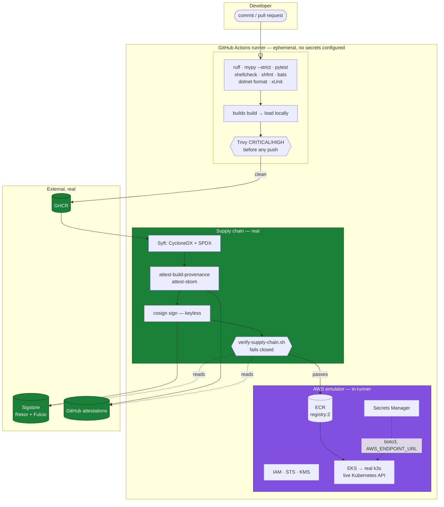

# Architecture

How the pieces fit, where the trust boundaries are, and why the emulator sits
where it does.

## The shape of it

Green is real and independently verifiable. Purple is emulated inside the runner.
The boundary between them is deliberate and is where the repository stops making
claims.

## Data flow of a deploy

1. **Resolve.** `resolve-image-digest.sh` turns the commit SHA tag into a digest,
   once. If this commit built no image of its own — a change to charts or scripts
   — it falls back to the most recently published image, which still has to clear
   the gate below.
2. **Verify.** `verify-supply-chain.sh` checks the cosign signature against a
   certificate identity constrained to this repository's workflows, then the SLSA
   provenance and CycloneDX SBOM attestations. Any failure exits 4 and the job
   stops. Nothing after this point runs on an unverified artifact.
3. **Gate.** `datadog-gate` refuses to proceed if a monitor for the service is
   alerting. Dry-run here, since there is no Datadog account.
4. **Promote.** `promote-image.sh` verifies *again*, then pulls by digest, retags
   and pushes to the emulated ECR. It reads the digest back out of the push
   output, because copying a manifest between registries does not preserve it.
5. **Provision.** A VPC, subnet and IAM role are created through the emulator, then
   `aws eks create-cluster`. The emulator starts a real k3s container; the job
   polls `describe-cluster` until `ACTIVE` (about fifteen seconds) and builds a
   kubeconfig from it.
6. **Network.** k3s and the emulated registry are joined on a user-defined Docker
   network with a DNS alias, because the default bridge has no name resolution and
   the kubelet resolves the registry by container name.
7. **Configure.** The application secret is seeded into the emulated Secrets
   Manager. The AWS credentials the pod needs are created as a Kubernetes Secret
   *by the workflow* — not written into `values-emulator.yaml`, because even a
   throwaway credential does not belong in a committed file.
8. **Deploy.** `helm upgrade --install --atomic`, pinned to the digest that exists
   in the target registry, with the emulator endpoint set to the cluster's bridge
   gateway so pods can reach it.
9. **Confirm.** `wait-for-rollout.sh`, then `smoke-test.sh` from inside the cluster
   through the Service DNS name, asserting JSON shape.
10. **On failure.** `helm rollback`, then `collect-diagnostics.sh` bundles the
    evidence into an artifact before the runner is destroyed.

## Why the emulator, and why here

The alternative designs both fail for a portfolio repository:

- **A real AWS account.** Costs money, requires credentials in the repository,
  and cannot be reproduced by a reader. The moment a reviewer cannot run it, the
  repository is a description of a pipeline rather than a pipeline.
- **Mocking Kubernetes.** Proves nothing. A rollout that never happened cannot
  fail in the ways real rollouts fail — and the failures in this repository's
  history are exactly the interesting part: ImagePullBackOff from a registry the
  kubelet could not resolve, a readiness probe timing out because boto3's default
  connect timeout is sixty seconds.

The emulator sits precisely at the AWS API boundary. Everything above it — the
application, the chart, Helm, Kubernetes, the probes, the smoke test — is real.
Everything below it is emulated, and the README says so before it says anything
else.

## What the two Terraform configurations are for

`infra/aws/` is applied twice, in two different senses:

- **`terraform test` with mocked providers** (`infra-test.yml`) asserts the things
  an apply cannot: that no OIDC subject claim contains a wildcard, that the EKS
  API is not publicly reachable, that Karpenter cannot terminate instances it does
  not own, that ECR tags are immutable. Twelve assertions, no credentials, no
  network. **The emulator does not enforce IAM**, so this is the only thing that
  proves the policies are scoped.
- **A genuine `terraform apply`** against the emulator
  (`infra-apply-emulated.yml`) proves the graph resolves and the resources can be
  created in the order described — 58 resources, read back through the AWS CLI,
  then destroyed.

Neither proves the other. Both are needed.

`infra/datadog/` is validated only. It exists because `datadog_gate.py` queries
monitors, and a gate that queries monitors nobody defined is theatre.

## Configuration split

| | `values-emulator.yaml` | `values-prod.yaml` |
| --- | --- | --- |
| Applied | Yes, to k3s, on every deploy run | **Never** |
| Validated | helm lint, kubeconform, kube-linter, conftest | Identically |
| Replicas | 1 | 3, with a PDB at `minAvailable: 2` |
| Identity | Static credentials from a Secret created at deploy time | IRSA, scoped to one namespace and service account |
| Ingress | None | ALB Controller, TLS 1.3, IP targets |
| Spread | None | `topologySpreadConstraints` over zones, `DoNotSchedule` |
| Secrets | Seeded directly | ExternalSecret from AWS Secrets Manager |

IRSA and the ALB Controller cannot function under the emulator — IRSA needs a real
OIDC provider federated with real IAM, and the controller needs a real account to
call. That is exactly why they live in a separate file that is validated but never
applied, and why the file says so in a comment at the top.
